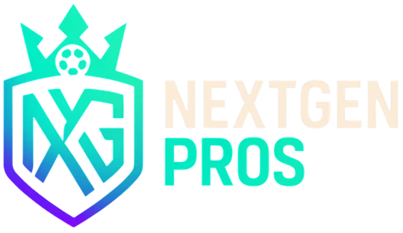

# NextGen Pros - Football Player Management Platform

<div align="center">



**A comprehensive football player scouting and management platform connecting players, scouts, clubs, and academies.**

[](https://nextjs.org/)
[](https://react.dev/)
[](https://tailwindcss.com/)
[](https://redux-toolkit.js.org/)

</div>

---

## 📋 Table of Contents

- [Overview](#overview)
- [Features](#features)
- [Tech Stack](#tech-stack)
- [Project Structure](#project-structure)
- [Getting Started](#getting-started)
- [Design System](#design-system)
- [Current Implementation Status](#current-implementation-status)
- [Development Guidelines](#development-guidelines)
- [Contributing](#contributing)
- [Author](#author)
- [License](#license)

---

## 🌟 Overview

**NextGen Pros** is a modern web application designed to revolutionize football player scouting and management. The platform serves as a centralized hub where young football talents can showcase their skills, scouts can discover promising players, clubs can manage their academies, and administrators can oversee the entire ecosystem.

### Vision

To create a seamless digital ecosystem that connects football talent with opportunities, leveraging modern web technologies to provide an intuitive, efficient, and professional platform for all stakeholders in youth football development.

---

## ✨ Features

### 🎯 Multi-Dashboard System

#### Admin Dashboard ✅ **(In Development)**
- **User Management**: Comprehensive user role management and permissions
- **Settings Module**: 
  - General settings with platform branding
  - User management with registration controls
  - Monetization settings
  - Notification preferences
- **Profile Boosting Management**:
  - Boost player and event profiles
  - Manage boost requests with approval workflow
  - Track boosting analytics and revenue
  - View boost history
- **Dynamic Theme Customization**: Real-time brand color management via Redux
- **Analytics Dashboard**: Key metrics and performance indicators

#### Player Dashboard *(In Development)*
- Personal profile management
- Event registration and tracking
- Club/scout communication
- Performance analytics
- Profile visibility controls

#### Scout Dashboard *(In Development)*
- Player discovery and search
- Shortlisted players management
- Event attendance tracking
- Communication with players
- Scouting reports

#### Club Dashboard *(In Development)*
- Event management and creation
- Player applications review
- Academy management
- Communication system
- Analytics and insights

### 🎨 Advanced Design System
- **Dynamic Theming**: Redux-powered theme management with real-time updates
- **Gradient Aesthetics**: Modern gradient-based UI components
- **Dark Mode First**: Optimized for dark theme with carefully chosen color palettes
- **Responsive Design**: Mobile-first approach with seamless desktop scaling
- **Smooth Animations**: Tailwind-powered transitions and hover effects

### 🔐 Security & Authentication *(Planned)*
- Role-based access control (RBAC)
- NextAuth.js integration
- Secure session management
- Protected routes

---

## 🛠️ Tech Stack

### Core Technologies
- **[Next.js 15](https://nextjs.org/)** - React framework with App Router
- **[React 19](https://react.dev/)** - UI library with latest features
- **[TypeScript](https://www.typescriptlang.org/)** - Type-safe development *(Optional)*

### Styling & UI
- **[Tailwind CSS v3.4](https://tailwindcss.com/)** - Utility-first CSS framework
- **[shadcn/ui](https://ui.shadcn.com/)** - High-quality React components
- **[Lucide React](https://lucide.dev/)** - Beautiful icon library
- **[Poppins Font](https://fonts.google.com/specimen/Poppins)** - Modern typography

### State Management & Data
- **[Redux Toolkit](https://redux-toolkit.js.org/)** - Predictable state container
- **[React Redux](https://react-redux.js.org/)** - Official React bindings for Redux

### Development Tools
- **[ESLint](https://eslint.org/)** - Code linting
- **[PostCSS](https://postcss.org/)** - CSS transformation
- **[Autoprefixer](https://github.com/postcss/autoprefixer)** - CSS vendor prefixing

---

## 📁 Project Structure

```
nextgen-pros/
│
├── public/                          # Static assets
│   ├── logo.png                    # Platform logo
│   ├── user_pp.jpg                 # Default user profile picture
│   ├── MarcusSilva-1.jpg          # Sample player images
│   ├── EmmaRodriguez-2.jpg
│   ├── LiamOConnor-3.jpg
│   ├── SophieDubois-4.jpg
│   ├── Barcelona_Youth_Trial.png   # Event images
│   ├── Summer_Showcase_2025.png
│   └── Talent_Scout_Day.png
│
├── src/
│   ├── app/                        # Next.js App Router
│   │   ├── globals.css            # Global styles (Tailwind imports)
│   │   ├── layout.js              # Root layout with Redux provider
│   │   ├── page.js                # Landing page (root route)
│   │   │
│   │   ├── admin/                 # Admin dashboard ✅
│   │   │   ├── layout.js         # Admin layout (Sidebar + Topbar)
│   │   │   ├── dashboard/        # Main admin dashboard
│   │   │   │   └── page.js
│   │   │   ├── settings/         # Settings module
│   │   │   │   ├── layout.js    # Settings tab navigation
│   │   │   │   ├── page.js      # Redirect to general
│   │   │   │   ├── general/
│   │   │   │   │   └── page.js
│   │   │   │   ├── user-management/
│   │   │   │   │   └── page.js
│   │   │   │   ├── monetization/
│   │   │   │   │   └── page.js
│   │   │   │   └── notifications/
│   │   │   │       └── page.js
│   │   │   ├── boosting/         # Profile boosting module
│   │   │   │   ├── layout.js    # Boosting stats + tabs
│   │   │   │   ├── page.js      # Redirect to boosted-players
│   │   │   │   ├── boosted-players/
│   │   │   │   │   └── page.js
│   │   │   │   ├── boosted-events/
│   │   │   │   │   └── page.js
│   │   │   │   ├── boost-requests/
│   │   │   │   │   └── page.js
│   │   │   │   └── boost-history/
│   │   │   │       └── page.js
│   │   │   └── users/            # Placeholder pages
│   │   │       └── page.js
│   │   │
│   │   ├── boost-profile/         # Standalone boost profile page
│   │   │   └── page.js
│   │   │
│   │   ├── player/                # Player dashboard (In Development)
│   │   ├── scout/                 # Scout dashboard (In Development)
│   │   └── club/                  # Club dashboard (In Development)
│   │
│   ├── components/
│   │   ├── ui/                    # shadcn/ui components
│   │   │   ├── avatar.jsx
│   │   │   ├── button.jsx
│   │   │   ├── input.jsx
│   │   │   ├── tabs.jsx
│   │   │   └── toast.jsx
│   │   └── layout/                # Layout components
│   │       ├── Sidebar.jsx       # Universal sidebar
│   │       └── Topbar.jsx        # Universal topbar
│   │
│   ├── lib/
│   │   └── utils.js               # Utility functions (cn, etc.)
│   │
│   └── store/                     # Redux store
│       ├── store.js              # Store configuration
│       ├── StoreProvider.jsx     # Redux provider wrapper
│       └── slices/
│           └── themeSlice.js     # Theme state management
│
├── .eslintrc.json                 # ESLint configuration
├── .gitignore                     # Git ignore rules
├── components.json                # shadcn/ui configuration
├── jsconfig.json                  # JavaScript configuration
├── next.config.mjs                # Next.js configuration
├── package.json                   # Project dependencies
├── postcss.config.mjs             # PostCSS configuration
├── tailwind.config.mjs            # Tailwind CSS configuration
└── README.md                      # Project documentation
```

---

## 🚀 Getting Started

### Prerequisites

- **Node.js**: Version 18.0 or higher
- **npm**: Version 9.0 or higher (or yarn/pnpm)

### Installation

1. **Clone the repository**
   ```bash
   git clone <repository-url>
   cd nextgen-pros
   ```

2. **Install dependencies**
   ```bash
   npm install
   ```

3. **Add required assets**
   
   Place the following images in the `/public` folder:
   - `logo.png` - Platform logo
   - `user_pp.jpg` - Admin profile picture
   - Player images (MarcusSilva-1.jpg, etc.)
   - Event images (Barcelona_Youth_Trial.png, etc.)

4. **Run the development server**
   ```bash
   npm run dev
   ```

5. **Open your browser**
   
   Navigate to [http://localhost:3000](http://localhost:3000)

### Build for Production

```bash
# Create optimized production build
npm run build

# Start production server
npm start
```

---

## 🎨 Design System

### Color Palette

The platform uses a dynamic theming system managed through Redux. All colors are defined in `src/store/slices/themeSlice.js`:

```javascript
{
  primaryCyan: '#00E5FF',      // Primary accent, icons, borders
  primaryMagenta: '#9C27B0',   // Secondary accent, gradients
  backgroundDark: '#0B0D2C',   // Main background, inputs
  backgroundCard: '#12143A'    // Cards, sidebar, panels
}
```

### Gradient Patterns

#### Heading Gradient
```javascript
background: linear-gradient(90deg, #00E5FF 0%, #9C27B0 100%)
```

#### Icon Background Gradient
```javascript
background: linear-gradient(180deg, rgba(0, 229, 255, 0.2) 0%, rgba(156, 39, 176, 0.2) 100%)
```

#### Active Sidebar Item
```javascript
background: linear-gradient(90deg, rgba(0, 229, 255, 0.20) 0%, rgba(156, 39, 176, 0.20) 100%)
border-top: 1.25px solid rgba(0, 229, 255, 0.3)
```

### Typography

- **Font Family**: Poppins
- **Headings**: Bold (700)
- **Body Text**: Regular (400)

### Component Patterns

#### Stats Card
```jsx
<div 
  className="rounded-lg p-6 border"
  style={{
    backgroundColor: theme.colors.backgroundCard,
    borderColor: `${theme.colors.primaryCyan}33`
  }}
>
  {/* Icon with gradient */}
  <div style={{
    background: 'linear-gradient(180deg, rgba(0, 229, 255, 0.2) 0%, rgba(156, 39, 176, 0.2) 100%)'
  }}>
    <Icon />
  </div>
  <div className="text-3xl font-bold">{value}</div>
</div>
```

#### Primary Button
```jsx
<button 
  style={{
    backgroundColor: '#04B5A3',
    backgroundImage: 'none'
  }}
>
  Action
</button>
```

---

## 📊 Current Implementation Status

### ✅ Completed Features

#### Admin Dashboard (In Development)
- [x] Main dashboard with analytics
- [x] User management
- [x] Settings module
  - [x] General settings
  - [x] User management settings
  - [x] Monetization settings
  - [x] Notifications settings
- [x] Profile Boosting
  - [x] Boosted players management
  - [x] Boosted events management
  - [x] Boost requests with approval workflow
  - [x] Boost history
  - [x] Standalone boost profile page
- [x] Dynamic theme system with Redux
- [x] Responsive design (mobile to desktop)

### 🚧 In Development

#### Player Dashboard (0%)
- [ ] Profile management
- [ ] Event registration
- [ ] Messages
- [ ] Settings

#### Scout Dashboard (0%)
- [ ] Player discovery
- [ ] Shortlisted players
- [ ] Events
- [ ] Messages

#### Club Dashboard (0%)
- [ ] Event management
- [ ] Player applications
- [ ] Messages
- [ ] Settings

#### Landing Page (0%)
- [ ] Hero section
- [ ] Features showcase
- [ ] Testimonials
- [ ] Pricing
- [ ] Footer

### 🔮 Planned Features
- [ ] Authentication system (NextAuth.js)
- [ ] Real-time messaging
- [ ] Video upload and playback
- [ ] Advanced search and filtering
- [ ] Notification system
- [ ] Email integration
- [ ] Payment gateway integration
- [ ] Multi-language support

---

## 📝 Development Guidelines

### Code Style

1. **Use Redux for Theme Colors**
   ```javascript
   const theme = useSelector(state => state.theme)
   // Use theme.colors.primaryCyan, etc.
   ```

2. **Client Components**
   ```javascript
   'use client' // Add at top for interactive components
   ```

3. **Responsive Design**
   ```javascript
   className="grid grid-cols-1 md:grid-cols-2 lg:grid-cols-4 gap-6"
   ```

4. **shadcn/ui Components**
   ```javascript
   import { Button } from '@/components/ui/button'
   ```

### Best Practices

- ✅ Follow Figma design specifications
- ✅ Use Redux for all theme colors
- ✅ Implement mobile-first responsive design
- ✅ Use shadcn/ui for form elements
- ✅ Add smooth transitions and hover effects
- ✅ Maintain consistent spacing and sizing
- ❌ Avoid hardcoded colors
- ❌ Don't use localStorage/sessionStorage (not supported in production)
- ❌ Don't use Tailwind v4 syntax (project uses v3)

### Git Workflow

```bash
# Create feature branch
git checkout -b feature/player-dashboard

# Commit changes
git add .
git commit -m "feat: implement player dashboard stats cards"

# Push to remote
git push origin feature/player-dashboard
```

---

## 🤝 Contributing

We welcome contributions to NextGen Pros! Here's how you can help:

1. **Fork the repository**
2. **Create a feature branch** (`git checkout -b feature/Feature`)
3. **Commit your changes** (`git commit -m 'Add some Feature'`)
4. **Push to the branch** (`git push origin feature/Feature`)
5. **Open a Pull Request**

### Contribution Guidelines

- Follow the existing code style and structure
- Ensure your code follows the design system
- Test on multiple screen sizes
- Write clear commit messages
- Update documentation as needed

---

## 👨‍💻 Author

**Anik Paul**

- Role: Lead Developer & Architect
- Focus: Admin Dashboard, Core Architecture, Design System Implementation

---

## 📄 License

This project is proprietary and confidential. Unauthorized copying, distribution, or use of this software is strictly prohibited.

Copyright © 2025 NextGen Pros. All rights reserved.

---

## 🙏 Acknowledgments

- Figma design specifications provided by the UI/UX team
- Icons by [Lucide](https://lucide.dev/)
- UI components by [shadcn/ui](https://ui.shadcn.com/)
- Built with [Next.js](https://nextjs.org/)

---

## 📞 Support

For questions or support, please contact the development team through the project's internal communication channels.

---

<div align="center">

**Made with ❤️ by the RT**

</div>